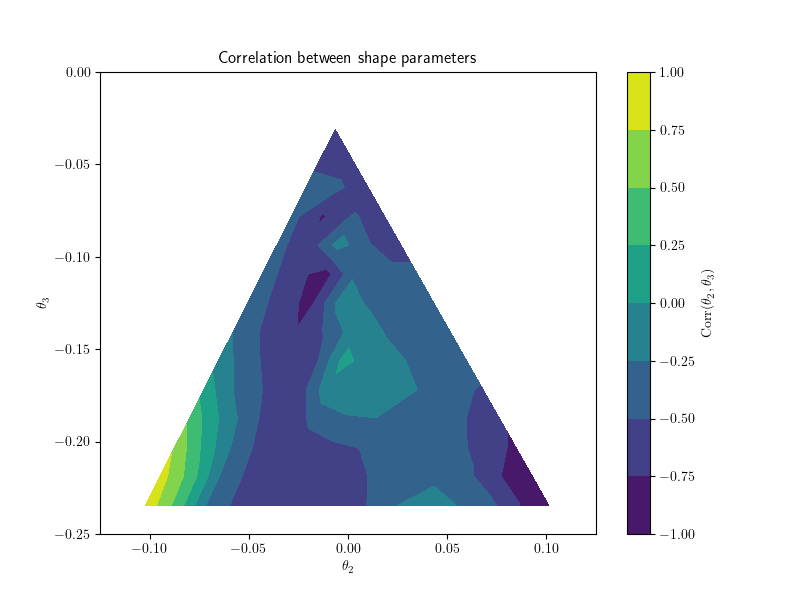
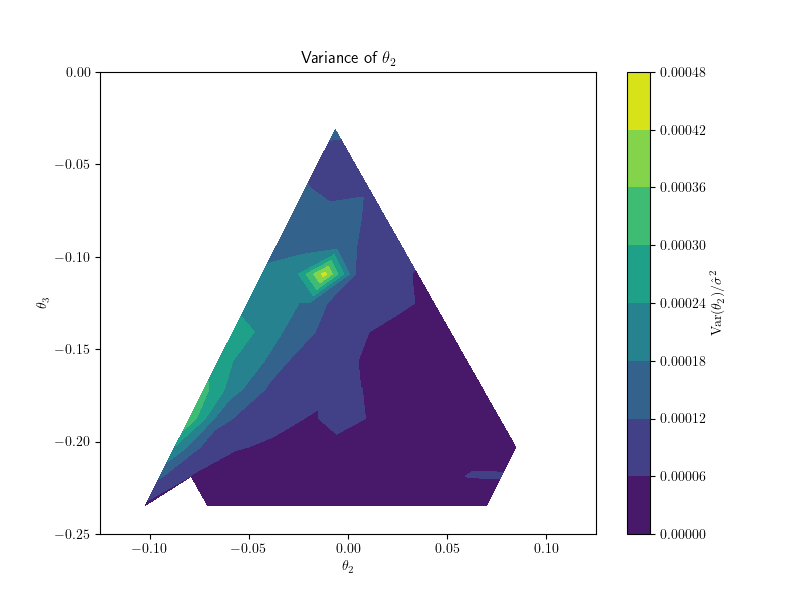

# Nov 14

I started this, as a repeat of probe-sigma-space 0, to get more data.

# Dec 12

After a couple days break to work on grad school and finish the GCE project, I fixed bugs in fit.py and will have to rerun. Used to be 24 cores per task, now 8, to see if speed increases. Runtime for 1 run is ~24 hrs local.

# Dec 20

I ran the previous test and it succeeded. I'm working on my compiling software now. I found a few bugs, but most importantly, I've changed the thin to exactly 10 in all cases so that I can automatically set the burn-in locally. Then I can get cleaner numbers.

# Dec 22

Having changed the minimization process so that the walkers more closely match the likelihood, I'm re-running the parameter search and oblateness test, with the hope that the minimization procedure will work. It works on the test and on some real parameters I tested locally.

Next step is to fix any more minimization problems, update the paper, and work on the intro.

# Jan 2

The minimization process failed, partially because of a segfault in the sim, and partially because the minimization technique sometimes failed. I added another tier of minimization, switched to Nelder-Mead, and fixed the segfault. Of those fits that succeeded, the contours are better but still not perfect.

But now that I look at the data properly, the fits that succeeded actually did quite well! The contours are OK!

I also changed the plotting software to save the original data and plot against that. Residuals are now more reliable.

# Jan 4

Today I pulled the data, and things worked. I believe my code runs successfully. However, I didn't get convergence because I hadn't run the MCMC for long enough. I extended the number of iterations from 10,000 to 100,000 and also sped up the model.

I sped up the model by precomputing more of the torque equation and by changing the delta t formula based on a more principled method for how much deviation from the true integral is too much. (I said if the fractional difference between the data for a point and some point displaced by a typical width of sigma from it is more than 1%, that's unacceptable. Differences of about 1% in overall accuracy is also ok.)

# Jan 5

The MCMC now converges after a few thousand iterations; it only took a few hours! I ran the code; it all looks great. Everything converged with no problems at all. Correct plots for corr and cov found, as well as plots for the varaince of sigma.

The next step should be to make these plots again for a, b, and c, then a sigma scan.

# Jan 7

Reran the code to make the likelihood half the chi squared. The above plots are still correct.

# Jan 11

Today I realized while making a plot of angular momentum that I flipped some inversions in the code. Reran the fits, also changing the escape velocity from 4 kps to 6 kps.