### July 27, 2021
<table><tr>
<th width=800px>
Run 0:

```
CADENCE = 3600
impact_parameter = 5 * EARTH_RADIUS
speed = 4000
spin = [0.00012, 0.00012, 0.00012]
jlms = [5.972e24, 5.972e22, -5.972e22, 4.972e22]
theta_true = (
    0, 1.2e6, 1.1e5, -4.9e5,
)
theta_start = (
    0.1, 1.0e6, 1.0e5, -5.0e5,
)
theta_range = (
    (0, 2 * np.pi), (0.5e6, 2e6), (0.5e5, 2.0e5), (-2.5e5, -1.0e6),
)
```
</th><th>
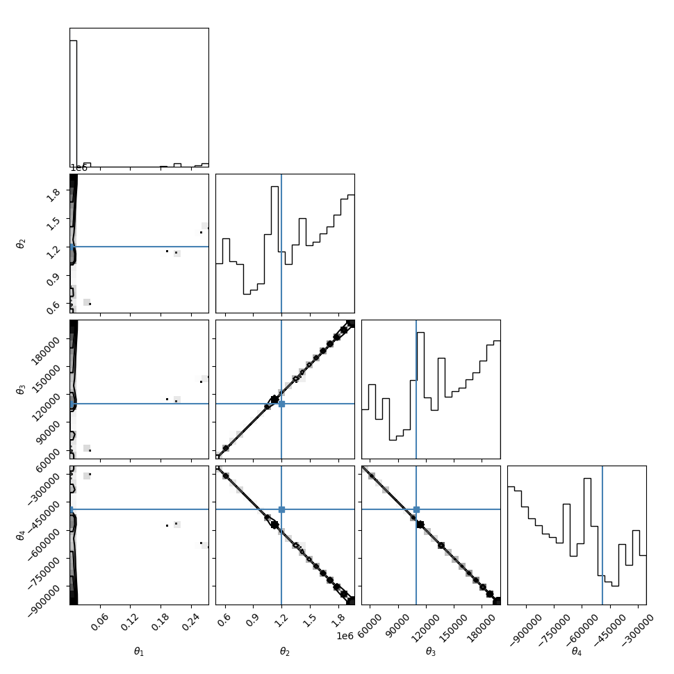
</th></tr></table>

The posterior for psi is too clustered up near zero because the true value is at the edge of the prior. Need to change the prior. Also, I don't like my error analysis. I'm going to change it to be proportional to the value itself.


---
### July 28, 2021

I'm running a run with the new prior and a new spin to test the new uncertainty (1) and one with more cadence to test that effect, with only J10 to see if it makes a difference (2).

<table><tr>
<th width=800px>
Run 1:

```
CADENCE = 3600
impact_parameter = 5 * EARTH_RADIUS
speed = 4000
spin = [0.00012, 0.00022, 0.00032]
jlms = [5.972e24, 5.972e22, -5.972e22, 4.972e22]
theta_true = (
    0, 1.2e6, 1.1e5, -4.9e5,
)
theta_start = (
    0.1, 1.0e6, 1.0e5, -5.0e5,
)
theta_range = (
    (-np.pi, np.pi), (0.5e6, 2e6), (0.5e5, 2.0e5), (-2.5e5, -1.0e6),
)
REL_SIGMA=0.1
```
</th><th>
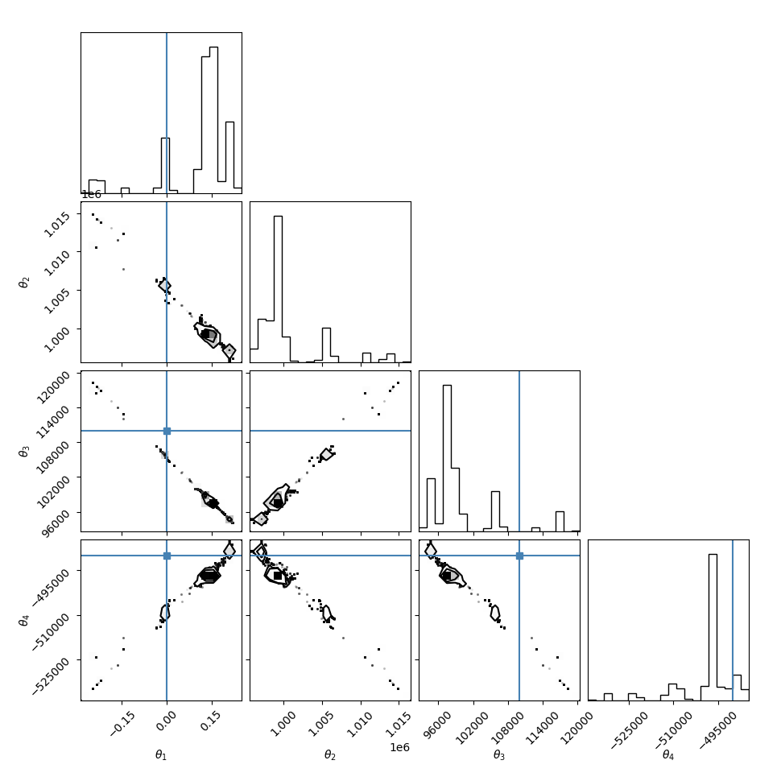
</th></tr><tr>
<th width=800px>
Run 2:

```
CADENCE = 120
impact_parameter = 5 * EARTH_RADIUS
speed = 4000
spin = [0.00012, 0.00022, 0.00032]
jlms = [5.972e24, 0, 0, 4.972e22]
theta_true = (
    0, 1.2e6, 1.1e5, -4.9e5,
)
theta_start = (
    0.1, 1.0e6, 1.0e5, -5.0e5,
)
theta_range = (
    (-np.pi, np.pi), (0.5e6, 2e6), (0.5e5, 2.0e5), (-2.5e5, -1.0e6),
)
REL_SIGMA=0.1
```
</th><th>
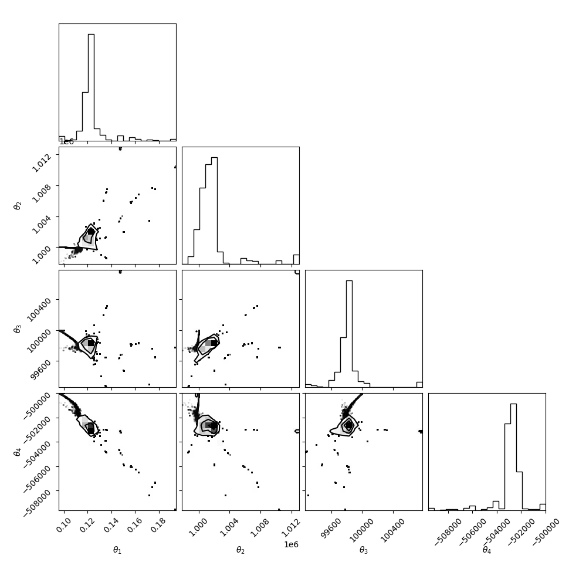
</th></tr></table>

The degeneracy remains in run 1 but is broken in run 2. Probably because the `jlm[1]` and `jlm[2]` have equal magnitude. I'll test that in the future. The other option is that the degeneracy is only broken if `jlm[3]` is big enough, or perhaps more cadence is needed to break degeneracy.

Neither corner plot is very good, probably due to lack of data. I could always run the fit for longer. In the future, I'll run for 7500 iterations, not 5000.

The fits for run 2 are nowhere near the correct value, so I'm going to change the error analysis again. This time it simulates the spin vector having an incorrect angular component, but a correct radial component. The error bars on large values are therefore smaller now. Hopefully that produces better fit behavior.


---
### July 29, 2021

I'm running the same as runs 1 and 2 but with the new error to detect improvement (3, 4). Then I'm running the same as run 0 for the same reason (5). To see if the degeneracy is broken by having `|jlm[1]| != |jlm[2]|`, I'm running run 0 with a new `jlm[2]` (6). Then the same as run 6 but with low cadence to test that effect in isolation.

<table><tr>
<th width=800px>
Run 3:

```
CADENCE = 3600
impact_parameter = 5 * EARTH_RADIUS
speed = 4000
spin = [0.00012, 0.00022, 0.00032]
jlms = [5.972e24, 5.972e22, -5.972e22, 4.972e22]
theta_true = (
    0, 1.2e6, 1.1e5, -4.9e5,
)
theta_start = (
    0.1, 1.0e6, 1.0e5, -5.0e5,
)
theta_range = (
    (-np.pi, np.pi), (0.5e6, 2e6), (0.5e5, 2.0e5), (-2.5e5, -1.0e6),
)
SIGMA=0.2
```
</th><th>
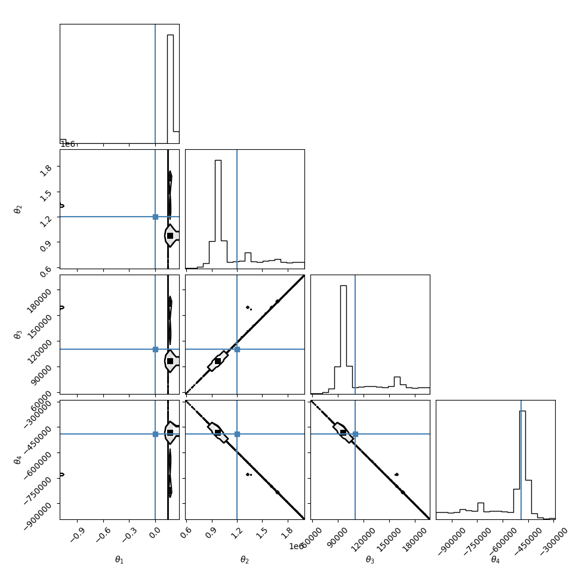
</th></tr><tr>
<th width=800px>
Run 4:

```
CADENCE = 120
impact_parameter = 5 * EARTH_RADIUS
speed = 4000
spin = [0.00012, 0.00022, 0.00032]
jlms = [5.972e24, 0, 0, 4.972e22]
theta_true = (
    0, 1.2e6, 1.1e5, -4.9e5,
)
theta_start = (
    0.1, 1.0e6, 1.0e5, -5.0e5,
)
theta_range = (
    (-np.pi, np.pi), (0.5e6, 2e6), (0.5e5, 2.0e5), (-2.5e5, -1.0e6),
)
SIGMA=0.2
```
</th><th>
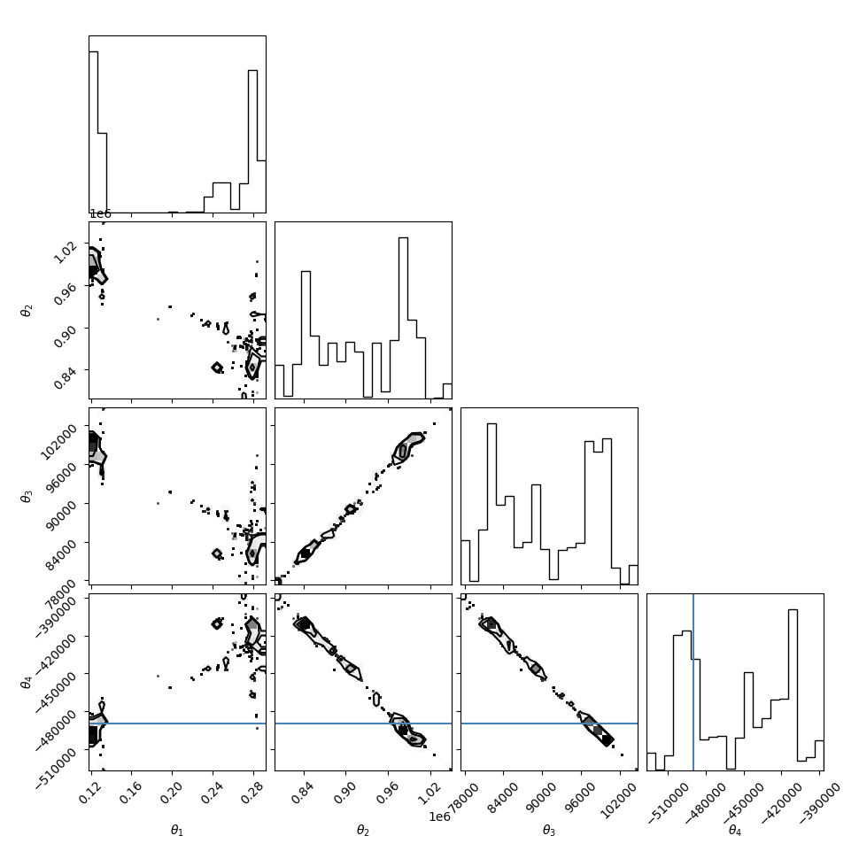
</th></tr><tr>
<th width=800px>
Run 5:

```
CADENCE = 3600
impact_parameter = 5 * EARTH_RADIUS
speed = 4000
spin = [0.00012, 0.00012, 0.00012]
jlms = [5.972e24, 5.972e22, -5.972e22, 4.972e22]
theta_true = (
    0, 1.2e6, 1.1e5, -4.9e5,
)
theta_start = (
    0.1, 1.0e6, 1.0e5, -5.0e5,
)
theta_range = (
    (0, 2 * np.pi, (0.5e6, 2e6), (0.5e5, 2.0e5), (-2.5e5, -1.0e6),
)
SIGMA=0.2
```
</th><th>
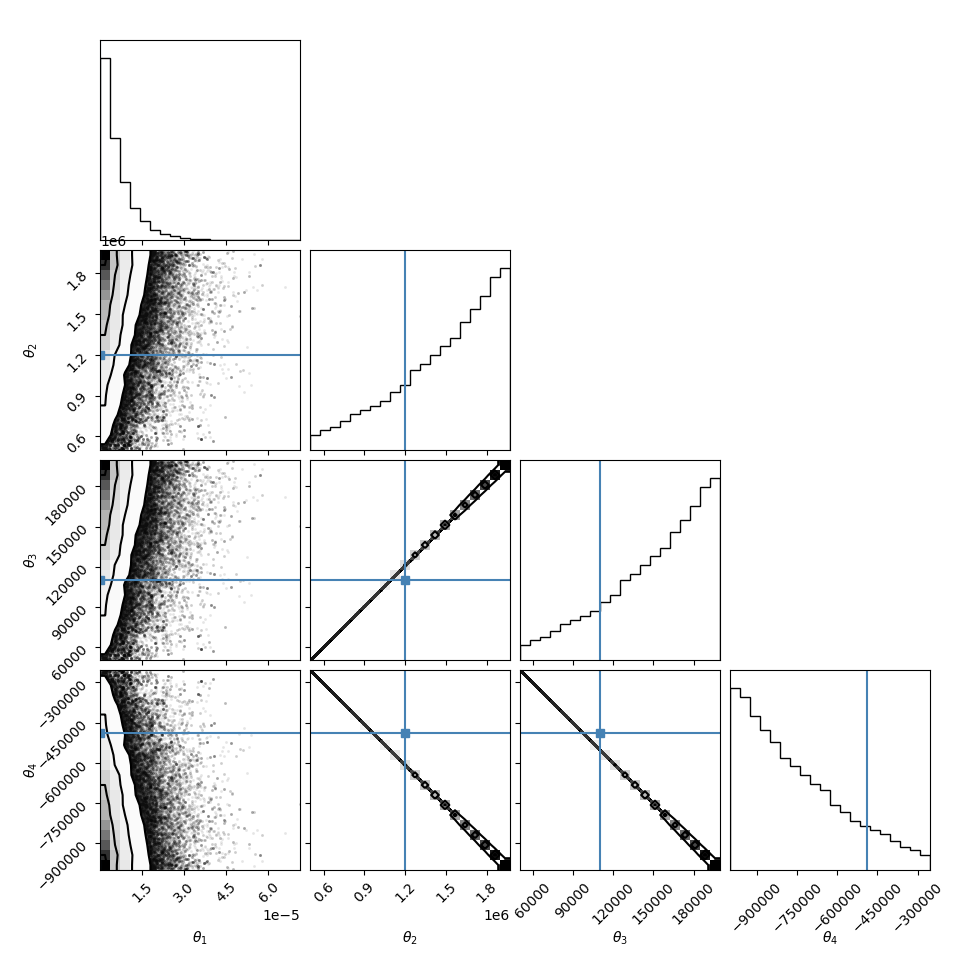
</th></tr><tr>
<th width=800px>
Run 6:

```
CADENCE = 3600
impact_parameter = 5 * EARTH_RADIUS
speed = 4000
spin = [0.00012, 0.00012, 0.00012]
jlms = [5.972e24, 5.16143e22, -7.421e22, 4.972e22]
theta_true = (
    0, 1.2e6, 1.1e5, -4.9e5,
)
theta_start = (
    0.1, 1.0e6, 1.0e5, -5.0e5,
)
theta_range = (
    (0, 2 * np.pi, (0.5e6, 2e6), (0.5e5, 2.0e5), (-2.5e5, -1.0e6),
)
SIGMA=0.2
```
</th><th>
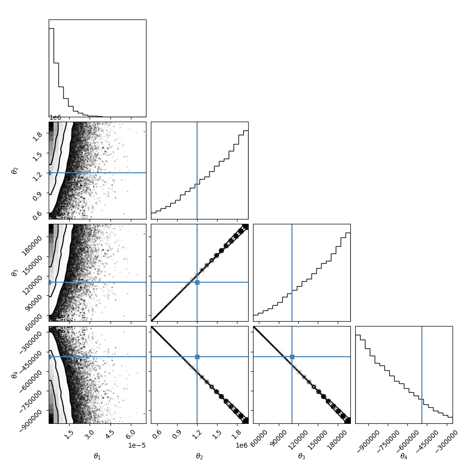
</th></tr><tr>
<th width=800px>
Run 7:

```
CADENCE = 120
impact_parameter = 5 * EARTH_RADIUS
speed = 4000
spin = [0.00012, 0.00012, 0.00012]
jlms = [5.972e24, 5.16143e22, -7.421e22, 4.972e22]
theta_true = (
    0, 1.2e6, 1.1e5, -4.9e5,
)
theta_start = (
    0.1, 1.0e6, 1.0e5, -5.0e5,
)
theta_range = (
    (0, 2 * np.pi, (0.5e6, 2e6), (0.5e5, 2.0e5), (-2.5e5, -1.0e6),
)
SIGMA=0.2
```
</th><th>

</th></tr></table>

Runs 5, 6, and 7 all have the same form. They share the fit method and an initial spin of `[0.00012, 0.00012, 0.00012]` in common. Run 0 is the only other run with that spin and it showed a largely similar effect. Mayve if I ran runs 5, 6, 7 for longer, I would see the slight preference of the true parameters. But instead, I'm going to run with an asymmetric spin, and try to figure out why a symmetric spin should introduce degeneracy.

Except in the case of run 7, introducing higher cadence seems to disrupt the fit. That seems counter-intuitive. Maybe there's a better cadence between.

Maybe increasing the l=1 components of Jlm changes the degeneracy? I'll try it. Weirdly, increasing b might as well, since it expands the time at periapsis.


---
### July 30, 2021
Runs 8.0, 8.1, 8.2, 8.3, 8.4 are cadence scans, otherwise the same as run 3. Run 9 tries increasing the J1m components. Run 10 is the same as run 4 but with cadence of 3600. Run 11.0, 11.1, 11.2 are the same as run 3 but with b multiplied by 2, 4, and 8 resp.

<table><tr>
<th width=800px>
Run 8.0:

```
CADENCE = 3000
impact_parameter = 5 * EARTH_RADIUS
speed = 4000
spin = [0.00012, 0.00022, 0.00032]
jlms = [5.972e24, 5.972e22, -5.972e22, 4.972e22]
theta_true = (
    0, 1.2e6, 1.1e5, -4.9e5,
)
theta_start = (
    0.1, 1.0e6, 1.0e5, -5.0e5,
)
theta_range = (
    (-np.pi, np.pi), (0.5e6, 2e6), (0.5e5, 2.0e5), (-2.5e5, -1.0e6),
)
SIGMA=0.2
```
</th><th>
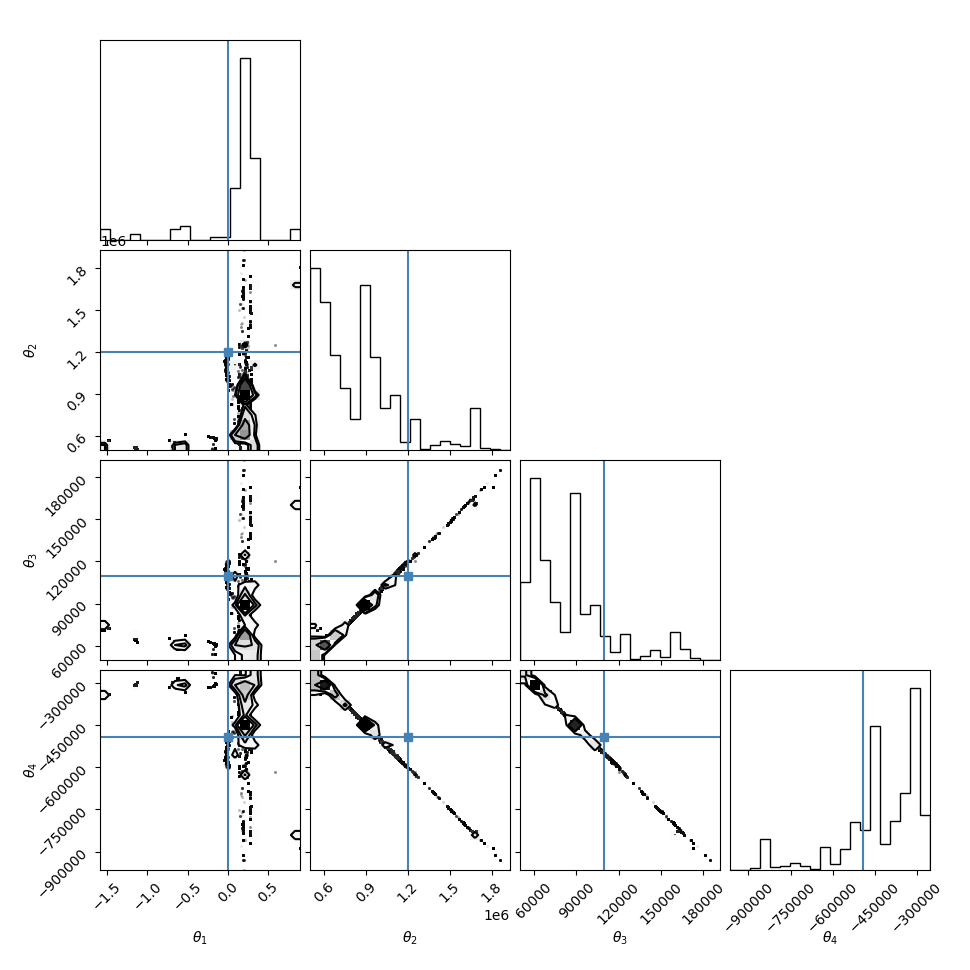
</th></tr><tr>
<th width=800px>
Run 8.1:

```
CADENCE = 2500
impact_parameter = 5 * EARTH_RADIUS
speed = 4000
spin = [0.00012, 0.00022, 0.00032]
jlms = [5.972e24, 5.972e22, -5.972e22, 4.972e22]
theta_true = (
    0, 1.2e6, 1.1e5, -4.9e5,
)
theta_start = (
    0.1, 1.0e6, 1.0e5, -5.0e5,
)
theta_range = (
    (-np.pi, np.pi), (0.5e6, 2e6), (0.5e5, 2.0e5), (-2.5e5, -1.0e6),
)
SIGMA=0.2
```
</th><th>
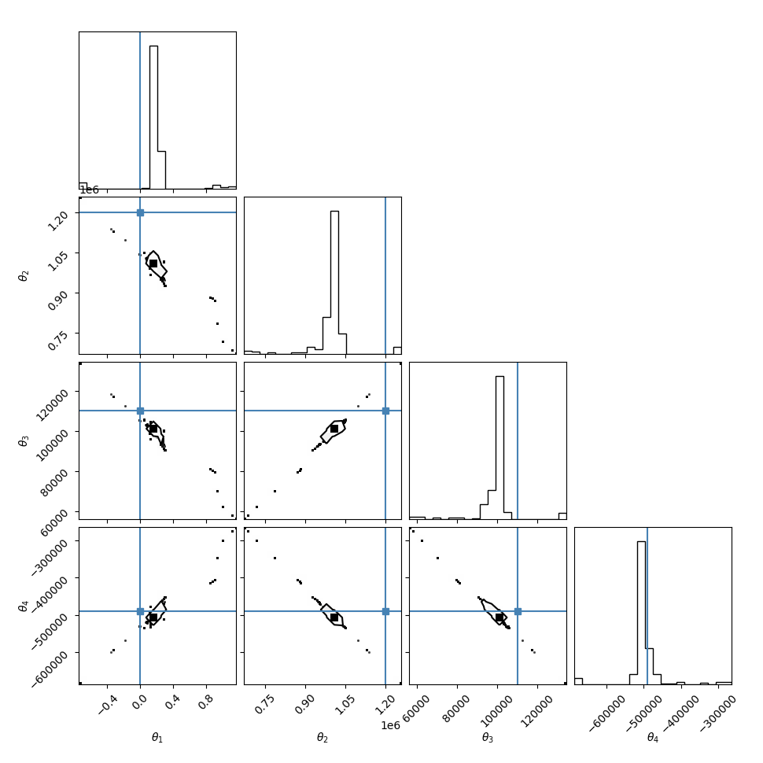
</th></tr><tr>
<th width=800px>
Run 8.2:

```
CADENCE = 2000
impact_parameter = 5 * EARTH_RADIUS
speed = 4000
spin = [0.00012, 0.00022, 0.00032]
jlms = [5.972e24, 5.972e22, -5.972e22, 4.972e22]
theta_true = (
    0, 1.2e6, 1.1e5, -4.9e5,
)
theta_start = (
    0.1, 1.0e6, 1.0e5, -5.0e5,
)
theta_range = (
    (-np.pi, np.pi), (0.5e6, 2e6), (0.5e5, 2.0e5), (-2.5e5, -1.0e6),
)
SIGMA=0.2
```
</th><th>
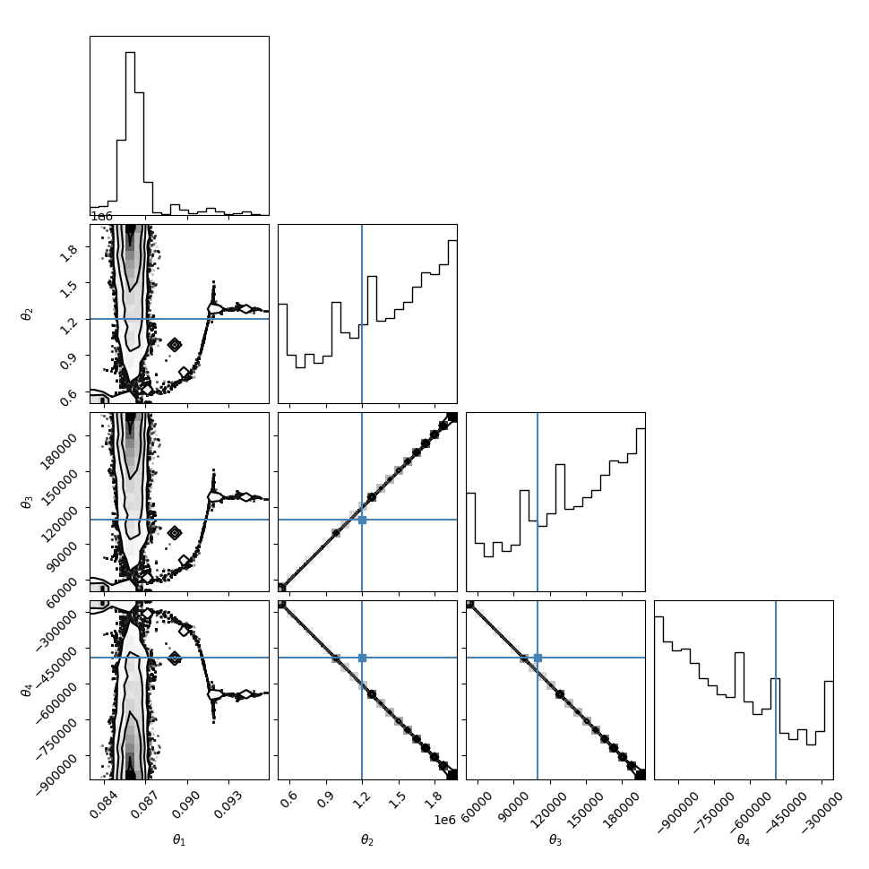
</th></tr><tr>
<th width=800px>
Run 8.3:

```
CADENCE = 1500
impact_parameter = 5 * EARTH_RADIUS
speed = 4000
spin = [0.00012, 0.00022, 0.00032]
jlms = [5.972e24, 5.972e22, -5.972e22, 4.972e22]
theta_true = (
    0, 1.2e6, 1.1e5, -4.9e5,
)
theta_start = (
    0.1, 1.0e6, 1.0e5, -5.0e5,
)
theta_range = (
    (-np.pi, np.pi), (0.5e6, 2e6), (0.5e5, 2.0e5), (-2.5e5, -1.0e6),
)
SIGMA=0.2
```
</th><th>

</th></tr><tr>
<th width=800px>
Run 8.4:

```
CADENCE = 1000
impact_parameter = 5 * EARTH_RADIUS
speed = 4000
spin = [0.00012, 0.00022, 0.00032]
jlms = [5.972e24, 5.972e22, -5.972e22, 4.972e22]
theta_true = (
    0, 1.2e6, 1.1e5, -4.9e5,
)
theta_start = (
    0.1, 1.0e6, 1.0e5, -5.0e5,
)
theta_range = (
    (-np.pi, np.pi), (0.5e6, 2e6), (0.5e5, 2.0e5), (-2.5e5, -1.0e6),
)
SIGMA=0.2
```
</th><th>
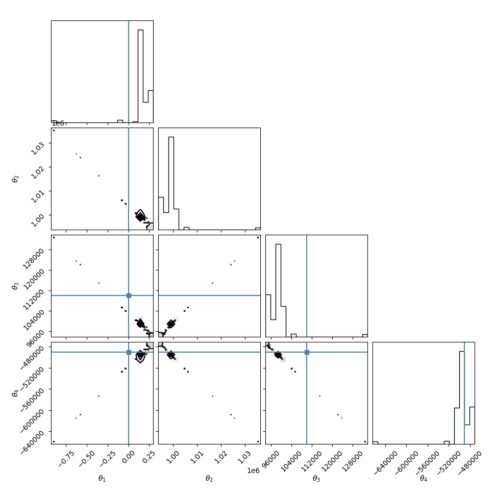
</th></tr><tr>
<th width=800px>
Run 9:

```
CADENCE = 3600
impact_parameter = 5 * EARTH_RADIUS
speed = 4000
spin = [0.00012, 0.00022, 0.00032]
jlms = [5.972e24, 5.972e23, -5.972e23, 4.972e23]
theta_true = (
    0, 1.2e6, 1.1e5, -4.9e5,
)
theta_start = (
    0.1, 1.0e6, 1.0e5, -5.0e5,
)
theta_range = (
    (-np.pi, np.pi), (0.5e6, 2e6), (0.5e5, 2.0e5), (-2.5e5, -1.0e6),
)
SIGMA=0.2
```
</th><th>
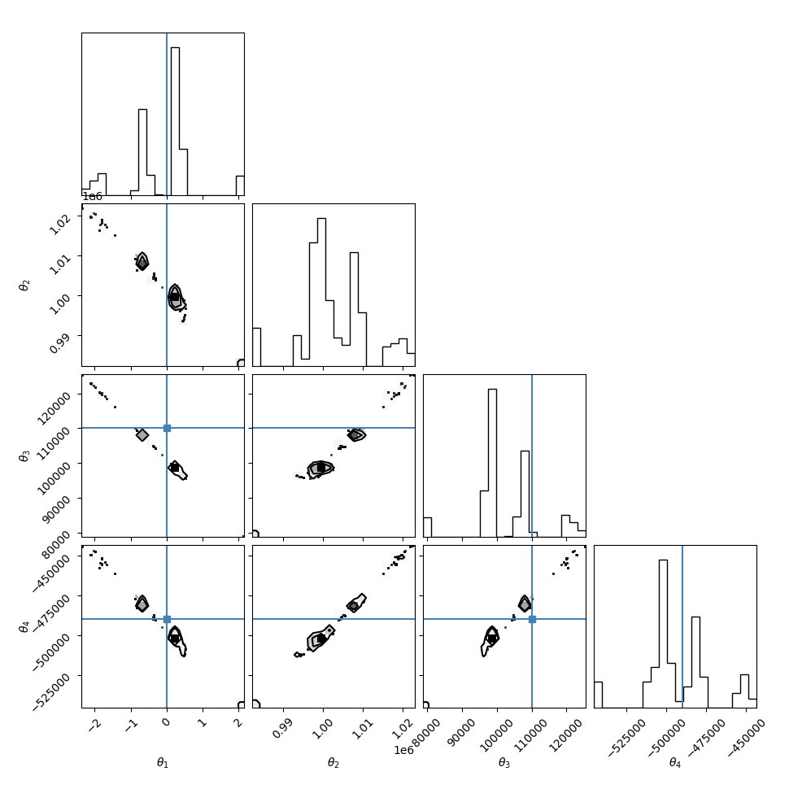
</th></tr><tr>
<th width=800px>
Run 10:

```
CADENCE = 3600
impact_parameter = 5 * EARTH_RADIUS
speed = 4000
spin = [0.00012, 0.00022, 0.00032]
jlms = [5.972e24, 0, 0, 4.972e22]
theta_true = (
    0, 1.2e6, 1.1e5, -4.9e5,
)
theta_start = (
    0.1, 1.0e6, 1.0e5, -5.0e5,
)
theta_range = (
    (-np.pi, np.pi), (0.5e6, 2e6), (0.5e5, 2.0e5), (-2.5e5, -1.0e6),
)
SIGMA=0.2
```
</th><th>
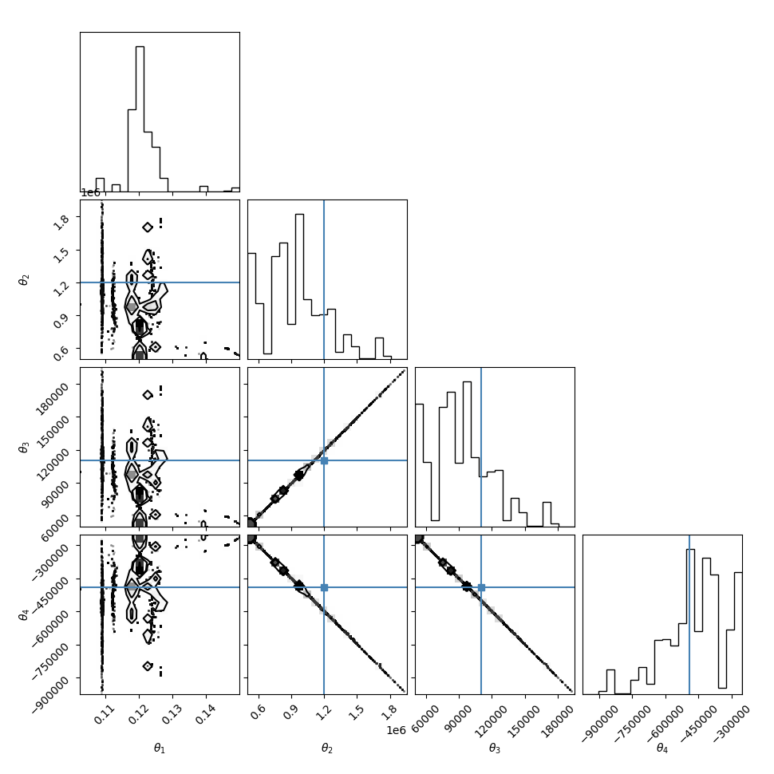
</th></tr><tr>
<th width=800px>
Run 11.0:

```
CADENCE = 3600
impact_parameter = 10 * EARTH_RADIUS
speed = 4000
spin = [0.00012, 0.00022, 0.00032]
jlms = [5.972e24, 5.972e22, -5.972e22, 4.972e22]
theta_true = (
    0, 1.2e6, 1.1e5, -4.9e5,
)
theta_start = (
    0.1, 1.0e6, 1.0e5, -5.0e5,
)
theta_range = (
    (-np.pi, np.pi), (0.5e6, 2e6), (0.5e5, 2.0e5), (-2.5e5, -1.0e6),
)
SIGMA=0.2
```
</th><th>
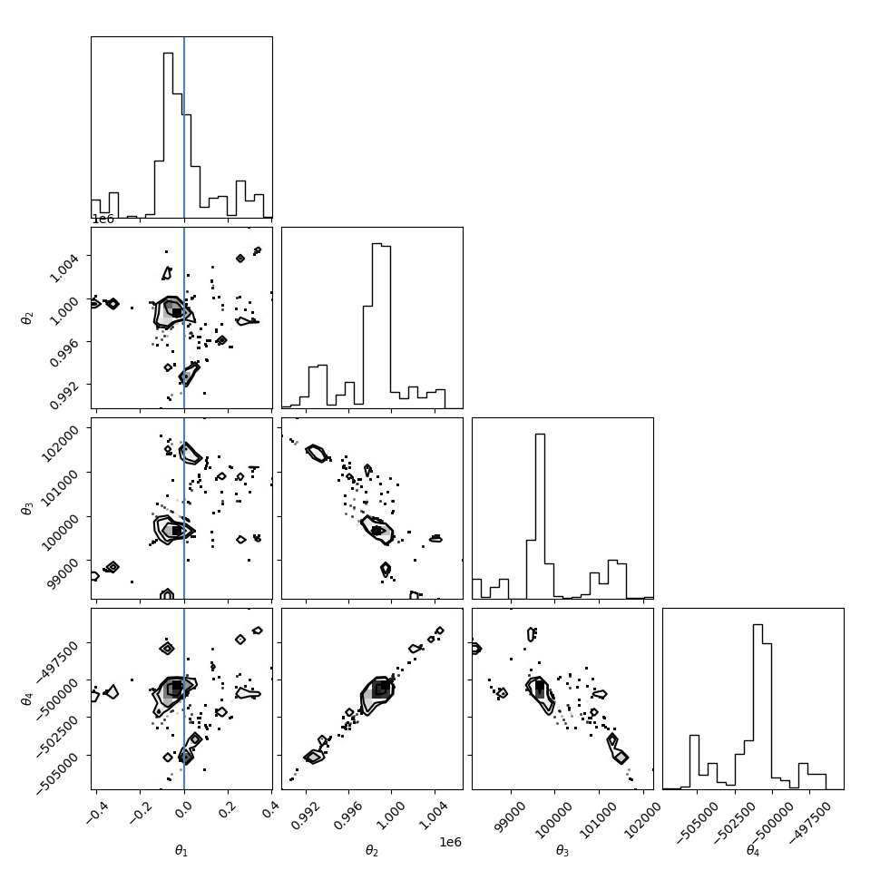
</th></tr><tr>
<th width=800px>
Run 11.1:

```
CADENCE = 3600
impact_parameter = 20 * EARTH_RADIUS
speed = 4000
spin = [0.00012, 0.00022, 0.00032]
jlms = [5.972e24, 5.972e22, -5.972e22, 4.972e22]
theta_true = (
    0, 1.2e6, 1.1e5, -4.9e5,
)
theta_start = (
    0.1, 1.0e6, 1.0e5, -5.0e5,
)
theta_range = (
    (-np.pi, np.pi), (0.5e6, 2e6), (0.5e5, 2.0e5), (-2.5e5, -1.0e6),
)
SIGMA=0.2
```
</th><th>
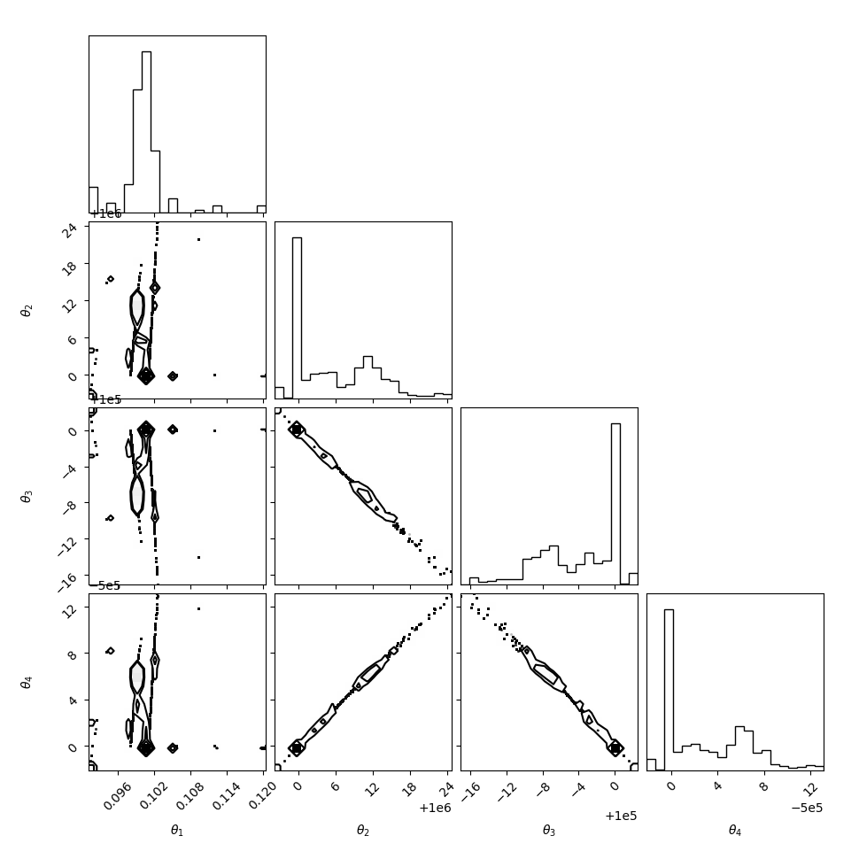
</th></tr><tr>
<th width=800px>
Run 11.2:

```
CADENCE = 3600
impact_parameter = 40 * EARTH_RADIUS
speed = 4000
spin = [0.00012, 0.00022, 0.00032]
jlms = [5.972e24, 5.972e22, -5.972e22, 4.972e22]
theta_true = (
    0, 1.2e6, 1.1e5, -4.9e5,
)
theta_start = (
    0.1, 1.0e6, 1.0e5, -5.0e5,
)
theta_range = (
    (-np.pi, np.pi), (0.5e6, 2e6), (0.5e5, 2.0e5), (-2.5e5, -1.0e6),
)
SIGMA=0.2
```
</th><th>

</th></tr><tr>
<th width=800px>
